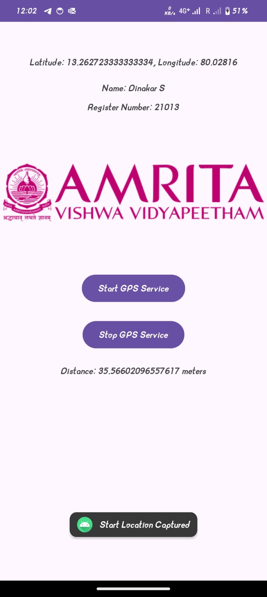

# GPS Tracking Android Application

## Overview
This project is an Android application that uses GPS to track the user's start and stop locations, calculate the distance traveled, and display the real-time latitude and longitude. The project also includes an "amrit" logo to enhance the user interface. This repository contains the APK, project documentation, screenshots, and all necessary files.

## Features
- **Real-time GPS Tracking**: Displays current latitude and longitude.
- **Start and Stop Location Tracking**: Records user's start and stop locations and calculates distance.
- **User Interface Enhancements**: Includes a logo and user details (name and register number).
- **Permissions Handling**: Manages permissions for accessing GPS data.

## Contents
- **Source Code**: Full Android Studio project files including Java and XML code.
- **APK**: Compiled APK ready to install on Android devices.
- **Documentation**: Detailed report on the implementation, challenges, and future enhancements.
- **Screenshots**: Screenshots showcasing the application interface and features.

## Tools and Technologies
- **Programming Language**: Java
- **Development Environment**: Android Studio
- **Libraries**: Android LocationManager, Android Manifest

## Implementation Details

### Permissions
The application requires the following permissions to work:
- **ACCESS_FINE_LOCATION**: For precise GPS tracking.
- **ACCESS_COARSE_LOCATION**: For obtaining approximate location data.

### Project Structure
- **MainActivity.java**: Contains the logic for GPS tracking, distance calculation, and permission handling.
- **activity_main.xml**: Defines the user interface with TextViews, Buttons, and an ImageView for the logo.
- **AndroidManifest.xml**: Includes the required permissions and other configuration details.

## Screenshots
Below are some screenshots of the application interface and features:

<div style="display: flex; justify-content: space-around;">    </div>

## Installation
To install the app on an Android device:
1. Clone the repository.
2. Navigate to the `apk/` folder.
3. Transfer the APK file to your Android device.
4. Install the APK.

## How to Use
1. Open the application.
2. Press "Start GPS Service" to capture the start location and begin tracking.
3. Press "Stop GPS Service" to capture the stop location and calculate the distance.

## Future Enhancements
- **Improved Accuracy**: Implement algorithms to filter noisy GPS data.
- **Map Integration**: Add Google Maps integration to provide a visual representation of the user's journey.
- **Background Tracking**: Enable GPS tracking in the background.

## Author
- **Name**: Dinakar S  
- **Register Number**: 21013

## License
This project is licensed under the MIT License - see the LICENSE file for details.

## Repository Structure
```
GPS-Tracking-Android-App/
|
├── apk/
│   └── gps_tracking_app.apk
|
├── doc/
│   └── Documentation.pdf
|
├── images/
│   ├── 1.jpg
│   ├── 2.jpg
│   └── 3.jpg
|
├── screenshots/
│   ├── start_screen.png
│   ├── tracking_screen.png
│   └── distance_screen.png
|
├── src/
│   ├── MainActivity.java
│   └── activity_main.xml
|
└── README.md
```

## Acknowledgments
- Android Studio documentation for guidance on GPS tracking.
- Stack Overflow community for troubleshooting tips.
- Google Maps API for potential future integration.

---
